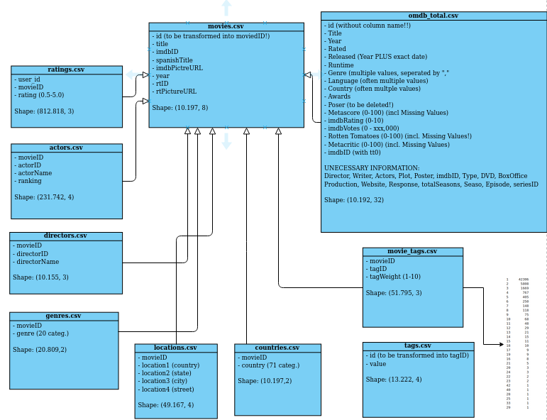

BDA-analytics-challenge
==============================

## Data Overview




## Special Stuff
This repository contains a recommender system for movies.
The model gets movieIDs and user_ids and predicts the user rating for each of them.

To run the model place the test dataset in the "../data/modeling/test/" folder and run  predict_ratings() function in predict.py in the src folder. If the function is not called from another script, additional lines need to be added to predict.py (See previous commits).
The test dataset is not allowed to have an index. Movies that originally weren't rated were excluded (The cold-start problem is not considered).

The function returns test_data, test_data_with_rating ('user_id', 'movieID' and 'rating').

The model uses collaborative filtering algorithms (SVD, KNNMeans from the Surprise Library) and a self-implemented content-based approach algorithm which uses a NearestNeighbor Search.

## Project Organization
------------
```
	├── .gitignore
├── .idea
│   ├── bda-analytics-challenge-ss2020.iml
│   ├── inspectionProfiles
│   │   └── profiles_settings.xml
│   ├── misc.xml
│   ├── modules.xml
│   ├── other.xml
│   ├── vcs.xml
│   └── workspace.xml
├── Pipfile
├── Pipfile.lock
├── README.md
├── __init__.py
├── data
│   ├── .DS_Store
│   ├── .ipynb_checkpoints
│   ├── UML\ Diagram.png
│   ├── modeling
│   │   ├── dev
│   │   │   └── dummy-file.txt
│   │   ├── test                                        --> contains Testfiles
│   │   │   ├── .DS_Store
│   │   │   ├── ratings_testset.csv
│   │   │   └── test.csv
│   │   └── train                                       --> Data for Training
│   │       ├── movies_id_updated.csv
│   │       ├── omdb_cleaned.csv
│   │       └── ratings_clean_std_0.csv
│   ├── preprocessed                                    --> Preprocessed and cleaned Data
│   │   ├── .gitkeep
│   │   ├── average_ratings.csv
│   │   ├── dummy-file.txt
│   │   ├── movies_id_updated.csv
│   │   ├── omdb_cleaned.csv
│   │   ├── plot.csv
│   │   └── ratings_clean_std_0.csv
│   ├── raw                                             --> Raw data and data acquired from Rotten Tomatoes and OMDB
│   │   ├── .DS_Store
│   │   ├── .gitkeep
│   │   ├── actors.csv
│   │   ├── countries.csv
│   │   ├── directors.csv
│   │   ├── genres.csv
│   │   ├── locations.csv
│   │   ├── movie_tags.csv
│   │   ├── movies.csv
│   │   ├── omdb_0.csv
│   │   ├── omdb_1.csv
│   │   ├── omdb_10.csv
│   │   ├── omdb_11.csv
│   │   ├── omdb_12.csv
│   │   ├── omdb_2.csv
│   │   ├── omdb_3.csv
│   │   ├── omdb_4.csv
│   │   ├── omdb_5.csv
│   │   ├── omdb_6.csv
│   │   ├── omdb_7.csv
│   │   ├── omdb_8.csv
│   │   ├── omdb_9.csv
│   │   ├── omdb_total.csv
│   │   ├── ratings.csv
│   │   └── tags.csv
│   └── tuning                                          --> csv-files from tuning the models  
│       ├── .DS_Store
│       ├── Collaborative\ 
│       │   ├── SVD_hyperparameters_1.csv
│       │   ├── SVD_hyperparameters_2.csv
│       │   ├── SVDpp_hyperparameters_1.csv
│       │   ├── SVDpp_hyperparameters_2.csv
│       │   ├── SVDpp_hyperparameters_3.csv
│       │   ├── gridsearch_SVD_basic.csv
│       │   ├── gridsearch_SVD_pp.csv
│       │   ├── gridsearch_knn_Z.csv
│       │   ├── gridsearch_knn_basic.csv
│       │   └── gridsearch_knn_means.csv
│       ├── CombinationTuning
│       │   ├── actual_ratings.csv
│       │   ├── number_ratings.csv
│       │   ├── predictions_0.csv
│       │   ├── predictions_1.csv
│       │   ├── predictions_2.csv
│       │   ├── predictions_3.csv
│       │   ├── predictions_4.csv
│       │   ├── predictions_5.csv
│       │   ├── predictions_6.csv
│       │   ├── predictions_7.csv
│       │   ├── predictions_8.csv
│       │   ├── predictions_9.csv
│       │   └── rmses_calculated.csv
│       ├── ContentBased
│       │   ├── .DS_Store
│       │   ├── Ergebnisse_Carmen_ContentBased.csv
│       │   ├── Hypersearch_Content_Carmen.csv
│       │   ├── Hypersearch_Content_FlorianGrabe.csv
│       │   ├── Hypersearch_Content_Maximilian\ Rominger.csv
│       │   ├── Hypersearch_Content_fx.csv
│       │   ├── Tuning_compChristinScheib.csv
│       │   ├── Tuning_compFlorianGrabe.csv
│       │   └── Tuning_compfx.csv
│       └── keywordDict.csv
├── docs                                                        --> Overview documents for the repository and data-structure
│   ├── .DS_Store
│   ├── Recommender_Systems_Overview.mmap
│   ├── Recommender_Systems_Overview_first_draft.pdf
│   ├── data
│   │   ├── modeling
│   │   │   ├── dev
│   │   │   │   └── dummy-file.txt
│   │   │   ├── test
│   │   │   │   └── test.csv
│   │   │   └── train
│   │   │       └── dummy-file.txt
│   │   ├── preprocessed
│   │   │   ├── .gitkeep
│   │   │   └── dummy-file.txt
│   │   └── raw
│   │       ├── .gitkeep
│   │       ├── actors.csv
│   │       ├── countries.csv
│   │       ├── directors.csv
│   │       ├── genres.csv
│   │       ├── locations.csv
│   │       ├── movie_tags.csv
│   │       ├── movies.csv
│   │       ├── ratings.csv
│   │       └── tags.csv
│   └── doc_train_data.pdf
├── models
├── notebooks                                               --> Notebooks used for testing, trying out models and exploring
│   ├── .DS_Store
│   ├── .gitkeep
│   ├── .ipynb_checkpoints
│   │   ├── Model_Combination-checkpoint.ipynb
│   │   ├── Model_CombinationFlo-checkpoint.ipynb
│   │   ├── OMDB_Cleaning-checkpoint.ipynb
│   │   └── omdb_files-checkpoint.ipynb
│   ├── Cleaning+Preprocessing                             
│   │   ├── .DS_Store
│   │   ├── .ipynb_checkpoints
│   │   │   ├── AverageRatingDataSet-checkpoint.ipynb
│   │   │   ├── Download_omdb_API-checkpoint.ipynb
│   │   │   ├── Feature\ and\ Data\ Analysis-checkpoint.ipynb
│   │   │   ├── ID_LookUp-checkpoint.ipynb
│   │   │   ├── Movie_ID_Conversion-checkpoint.ipynb
│   │   │   ├── Omdb_data_cleaning-checkpoint.ipynb
│   │   │   ├── Ratings_cleaning-checkpoint.ipynb
│   │   │   ├── feature_encoding-checkpoint.ipynb
│   │   │   ├── knnPreprocessing-checkpoint.ipynb
│   │   │   └── knn_preprocessing-checkpoint.py
│   │   ├── AverageRatingDataSet.ipynb
│   │   ├── Download_omdb_API.ipynb
│   │   ├── Feature\ and\ Data\ Analysis.ipynb
│   │   ├── ID_LookUp.ipynb
│   │   ├── Keyword_Dict.ipynb
│   │   ├── Movie_ID_Conversion.ipynb
│   │   ├── Omdb_data_cleaning.ipynb
│   │   ├── Ratings_cleaning.ipynb
│   │   ├── feature_encoding.ipynb
│   │   ├── knnPreprocessing.ipynb
│   │   ├── knn_preprocessing.py
│   │   ├── missing.csv
│   │   └── missing_filled.csv
│   ├── CollaborativeFiltering
│   │   ├── .DS_Store
│   │   ├── .ipynb_checkpoints
│   │   │   ├── Collaborative_Filtering.ipynb-checkpoint.orig
│   │   │   ├── Collaborative_Filtering_REMOTE_8192-checkpoint.ipynb
│   │   │   ├── Optimal_weights-checkpoint.ipynb
│   │   │   └── Surprise\ Quick\ Setup-checkpoint.ipynb
│   │   ├── KNN_Tuning.ipynb
│   │   ├── Optimal_weights.ipynb
│   │   └── Surprise\ Quick\ Setup.ipynb
│   ├── ContentbasedFiltering
│   │   ├── .DS_Store
│   │   ├── .ipynb_checkpoints
│   │   │   ├── CBF_knn_tuning-checkpoint.ipynb
│   │   │   ├── ContentBasedFiltering-checkpoint.ipynb
│   │   │   ├── ContentBasedFiltering_Try_Carmen-checkpoint.ipynb
│   │   │   ├── Ergebnisse_Carmen_ContentBased-checkpoint.csv
│   │   │   ├── Example_One_Hot-checkpoint.ipynb
│   │   │   ├── FeatureAnalysisForkNN-checkpoint.ipynb
│   │   │   ├── Hypersearch_Content_FlorianGrabe-checkpoint.csv
│   │   │   ├── ItemBasedFiltering-checkpoint.ipynb
│   │   │   ├── PlaygroundKnn-checkpoint.ipynb
│   │   │   ├── TuningHyperPara-checkpoint.ipynb
│   │   │   ├── knn_Carmen-checkpoint.py
│   │   │   └── knn_preprocessing-checkpoint.py
│   │   ├── CBF_knn_tuning.ipynb
│   │   ├── ContentBasedFiltering.ipynb
│   │   ├── ContentBasedFiltering_Try_Carmen.ipynb
│   │   ├── FeatureAnalysisForkNN.ipynb
│   │   ├── ItemBasedFiltering.ipynb
│   │   ├── TuningHyperPara.ipynb
│   │   ├── __pycache__
│   │   │   └── knn_preprocessing.cpython-38.pyc
│   │   ├── keywordDict.csv
│   │   ├── knn_Carmen.py
│   │   ├── knn_model.py
│   │   └── knn_preprocessing.py
│   ├── Model_Combination.ipynb
│   ├── Playground
│   │   ├── .DS_Store
│   │   ├── .ipynb_checkpoints
│   │   │   ├── BDA_Christin_V1-checkpoint.ipynb
│   │   │   ├── Example_One_Hot-checkpoint.ipynb
│   │   │   ├── GenerateTestset-checkpoint.ipynb
│   │   │   └── Output-checkpoint.ipynb
│   │   ├── BDA_Christin_V1.ipynb
│   │   ├── Example_One_Hot.ipynb
│   │   ├── GenerateTestset.ipynb
│   │   ├── Keyword_Dict.ipynb
│   │   ├── Output.ipynb
│   │   ├── ratings_testset.csv
│   │   └── ratings_testset3.csv
│   └── knn_features.py
├── requirements.txt
├── src                                                     --> contains all python-scripts to run the model
│   ├── .DS_Store
│   ├── .ipynb_checkpoints
│   │   ├── additional_features-checkpoint.py
│   │   ├── predict-checkpoint.py
│   │   ├── preprocessing-checkpoint.py
│   │   └── train-checkpoint.py
│   ├── additional_features.py
│   ├── predict.py
│   ├── predicted_ratings.csv
│   ├── preprocessing.py
│   └── train.py
└── test.py                                                --> Unittest to check whether output is in the right format

```
